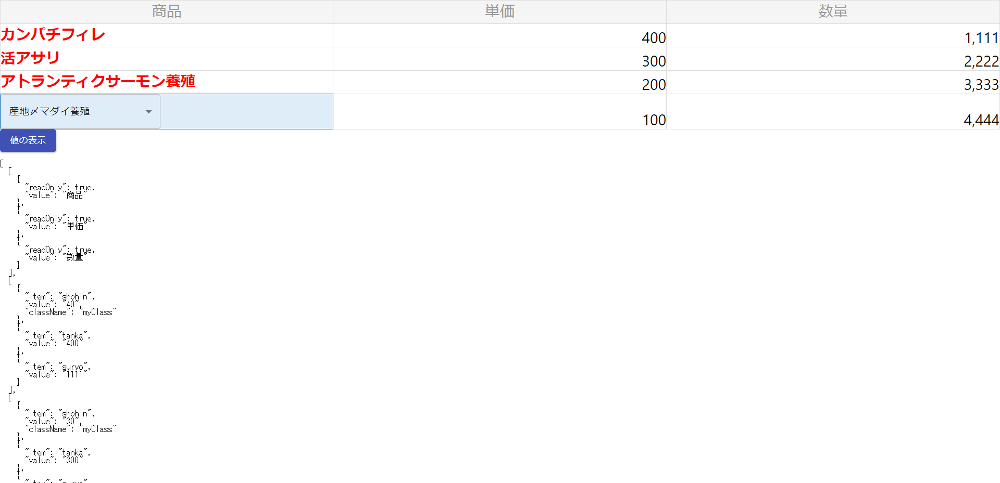

# sample-nadbm-react-datasheet

## インストール

```
> yarn add react-datasheet
> yarn add @material-ui/core
```

## GitHub

https://github.com/nadbm/react-datasheet

## WebSite

https://nadbm.github.io/react-datasheet/

## 画面イメージ



## 動作説明

- 「値の表示」ボタン押下で、現在のスプレッドのデータが表示される
- 商品SELECTを変更すると、商品に対する単価が自動セットされる
- セルを選択して Ctrl+C、その後、別のセルを選択して Ctrl+V で値をコピペできる（複数セルのコピペ可能）

